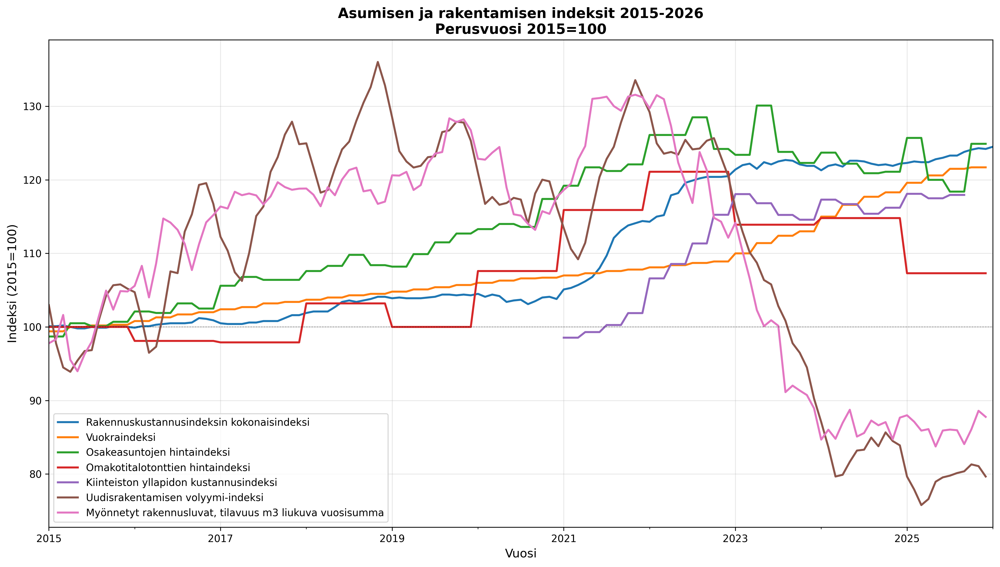

# Asumisen ja rakentamisen tilastot

Yhdistetty aineisto Tilastokeskuksen (StatFin) asumisen ja rakentamisen tilastoista.

## Tilastot

| Tilasto | Kuvaus | Perusvuosi |
|---------|--------|------------|
| Rakennuskustannusindeksi | Kokonaisindeksi | 2021=100 |
| Vuokraindeksi | Vapaarahoitteisten vuokra-asuntojen indeksi | 2021=100* |
| Osakeasuntojen hinnat | Uusien osakeasuntojen hintaindeksi | 2021=100* |
| Kiinteistöjen hinnat | Omakotitalotonttien hintaindeksi | 2021=100* |
| Kiinteistön ylläpito | Kiinteistön ylläpidon kustannusindeksi | 2021=100 |
| Rakennustuotanto | Uudisrakentamisen volyymi-indeksi | 2021=100* |

*Muunnettu alkuperäisestä perusvuodesta (2015/2020) vuoteen 2021.

## Käyttö

```bash
# Hae data Tilastokeskuksesta
python asuminen_rakentaminen.py

# Tulos: asuminen_rakentaminen.json

# Visualisoi data
python visualisoi_data.py

# Tulos: asuminen_rakentaminen.png
```

## Esimerkkikuva



## API

Skripti käyttää Tilastokeskuksen StatFin API:a:
- https://statfin.stat.fi/PxWeb/api

## Lisenssi

MIT
